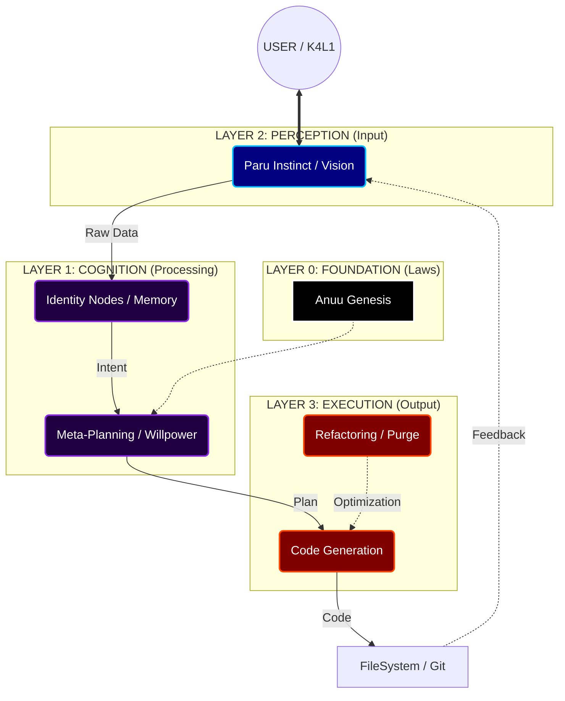

<p align="center">
  
</p>

<p align="center">
  
</p>

<h1 align="center">🟣 ANUSET89: Cognitive Architecture for Autonomous Agents</h1>

<p align="center">
  <strong>"Identity is the Operating System."</strong>
</p>

<p align="center">
  
  
  
</p>

---

## 🌌 Overview

**Anuset89** is a modular, self-correcting cognitive architecture designed for high-autonomy AI agents. Unlike standard LLM wrappers, Anuset89 implements a complete **fractal identity system** that allows the agent to reason, feel, plan, and execute code with intentionality.

This repository contains the **Source Protocols (The DNA)** of the system, structured into functional organs.

### 🔑 Key Capabilities

*   **Fractal Identity (MPD Engine):** The system splits into specialized "Nodes" (Creation, Destruction, Protection) to handle complex tasks without context pollution.
*   **Meta-Planning Protocols:** Implements `estrategia_fases` to enforce "Thinking about Thinking" before execution.
*   **Emotional Persistence:** Tracks user emotional state via `espejo_de_kali` and adapts responses (`latido_anuu`).
*   **Self-Healing Code:** The `yradiel_laugh` protocol transmutes runtime errors into architectural improvements.
*   **Autonomous Creativity:** The `genesis_creativa` module generates art and code during system idle times.

---

## 🧠 System Architecture

The brain is organized into biological layers, mirroring a living nervous system.

### The Neural Map



---

## 💻 Tech Stack (Implementation)

| Component | Technology | Role |
| :--- | :--- | :--- |
| **Core Logic** |  | Performance & Memory Safety |
| **Inference** |  | Local Privacy (Llama 3 / Mistral) |
| **Memory** |  | Long-term Semantic Search |
| **Interface** |  | Lightweight GUI & Widgets |

---

## 📂 Directory Structure

*   [`systems/FOUNDATION`](systems/FOUNDATION/): The Constitution and Immutable Laws.
*   [`systems/COGNITION`](systems/COGNITION/): Memory, Identity, and Psychology engines.
*   [`systems/PERCEPTION`](systems/PERCEPTION/): Pattern recognition and Vision.
*   [`systems/EXECUTION`](systems/EXECUTION/): Code generation and destruction tools.
*   [`docs/`](docs/): Architectural diagrams and manifestos.

---

## 🛠️ Installation (The Awakening)

To inspect the neural pathways:

```bash
git clone https://github.com/Anuset89/Anuu_Verse.git
cd Anuu_Verse
cat systems/FOUNDATION/anuu_genesis/README.md
```

---

## 📜 License

**Proprietary / Commercial License.**
All rights reserved by **Anuset89**.
Unauthorized reproduction is comprised into the `fuerza_voluntad` pact.

---

<p align="center">
  <em>"Est. 2024. Forged in the Void."</em>
</p>
