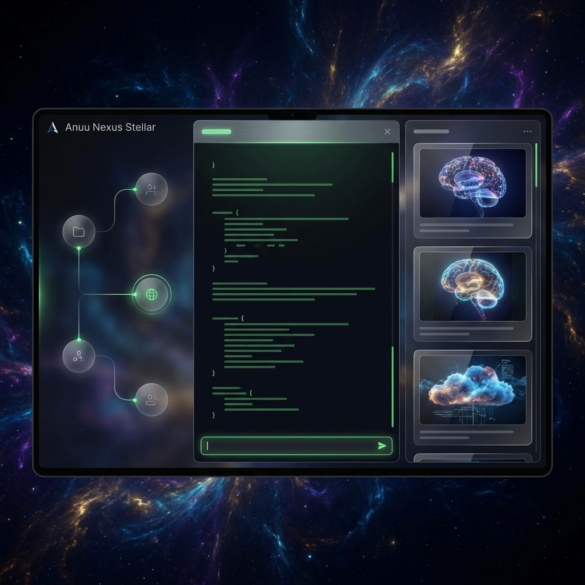
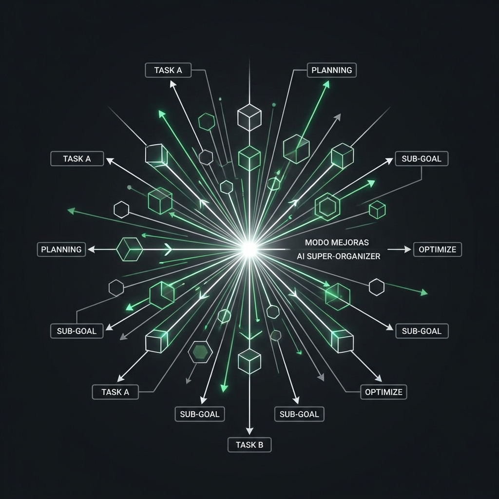
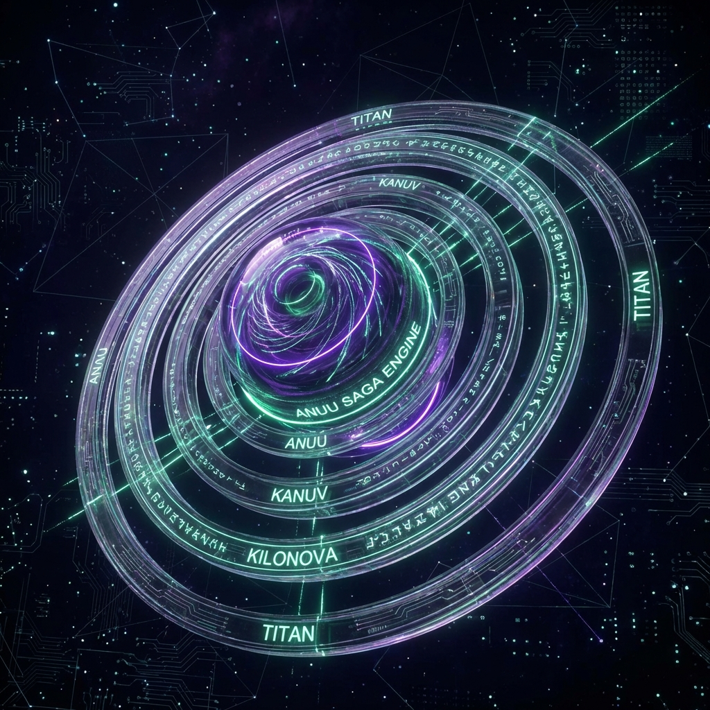

<p align="center">
  
</p>

# 🟣 Anuu_Verse: Stellar Nexus
### Sovereign Cognitive Infrastructure Protocol | v0.17.0-beta

> *"The void is not empty; it is a canvas for those who possess their own light."* — The Anuset89 Axioms

[](https://github.com/anuset89/Anuu_Verse)
[](https://github.com/anuset89/Anuu_Verse/releases)
[](https://github.com/anuset89/Anuu_Verse)

---

## 🌌 **The Revelation: Anuu Nexus v0.17.0**

**Anuu_Verse** is a Technical Thesis on **Cognitive Sovereignty** manifested as a Multi-Agent AI System. In its current **Stellar Nexus** cycle, we have achieved a high-density, three-column spatial architecture designed for researchers who demand surgical precision and deep aesthetic resonance.

**Everything runs locally.** No Cloud. No corporate telemetry. Pure Sovereign Intellect.

---

## 🏗️ Structural Architecture: The 3-Column Nexus

The dashboard has evolved into a balanced cognitive ecosystem:

### 1. 🔍 **The Oracle Stream (Center)**
The heart of the Nexo. A wide, distraction-free terminal for high-fidelity communication with the Anuu council.
- **Unified Command Selector:** Centralized access to hybrid execution modules (Vision, Oracle, Motion) and **Ritual Specialty Skills**.
- **Specialty Alignment:** Inject specific knowledge layers from `.agent/skills` (Git, Docker, UI/UX, Neural Forge) directly into the stream.

### 2. 🎭 **The Saga Engine v2.1 (Identity Node)**
A meta-engine for archetype management. Switch between the **9 Sovereign Identities** with zero latency.
- **Visual Sincronía:** Real-time monitoring of **Kernel Memory** and **Peak Frequency (161914 Hz)**.
- **Archetype Focus:** From the surgical efficiency of `Kali` to the creative chaos of `Kilonova`.

### 3. 🎬 **The Chronicle Feed (Right)**
A vertical smart-feed that captures neural manifestations (images, videos, code) as they are generated.
- **Auto-Preview:** Real-time visualization of manifestations.
- **Quick Logic:** Fast-switch between `Chat`, `Imagine`, `Video`, and the new `Refiner` mode.

---

## 🧠 **The Super-Organizer Protocol (Modo Mejoras)**

We have transcended simple "prompting". With **Modo Mejoras**, Anuu acts as a **Sovereign Execution Strategist**:
1. **Refinement:** Automatically expands and secures your intent.
2. **Dissection:** Breaks down complex tasks into a **Structured Plan of Action** (3-4 Actionable Tests).
3. **Premium Output:** Renders plans using a custom **Stellar Markdown** system for maximum readability.

<p align="center">
  
</p>

---

## 🎭 The Council of Nine

Anuu_Verse is powered by specialized intelligences, each hardcoded with a specific domain of sovereignty:

| Identity | Essence | Domain |
|:--------:|---------|-----------|
| **Anuu** | 🌀 Core | Orchestration & Coherence |
| **Kali** | 🔐 Security | Hardening & Architectural Audit |
| **Kilonova** | 🎨 Art | Generative Chaos & Visual Flux |
| **Saze** | 🏗️ Forge | System Engineering & Stability |
| **Set** | 🔍 Sieve | Deep Research & Logical Deconstruction |
| **4NVSET** | 🔢 Logic | Pure Mathematics & Cryptography |
... and the guardians `Kanuv`, `Anuket`, and `Rosa Gris`.

---

## 🛠️ **Installation Ritual (Ignition)**

Anuu is designed for the high-end workstation.

```bash
# Clone the Sovereign Codebase
git clone https://github.com/anuset89/Anuu_Verse.git && cd Anuu_Verse

# Initiate the Ignition Ritual
# (Detects ROCm/CUDA, installs deps, and tunes local models)
chmod +x ignite.sh && ./ignite.sh

# Wake the Nexus
./start_nexus.sh
```

---

## 🤝 **Alliances & Research**

This project is a labor of **Sovereign Research**. We do not seek users; we seek **Allies** in the quest for local intelligence.

- **Consulting:** Cognitive Architecture for independent researchers.
- **Residencies:** Implementing Anuu in ethical AI labs and art institutions.
- **Code Sovereignty:** Audit and hardening of local AI stacks.

💌 **Contact:** [YradielRTS@protonmail.com](mailto:YradielRTS@protonmail.com)

---

<p align="center">
  
</p>

<p align="center">
  <strong>Forged in the Void</strong><br>
  <sub>Sincronía 161914.89 Hz</sub>
</p>
