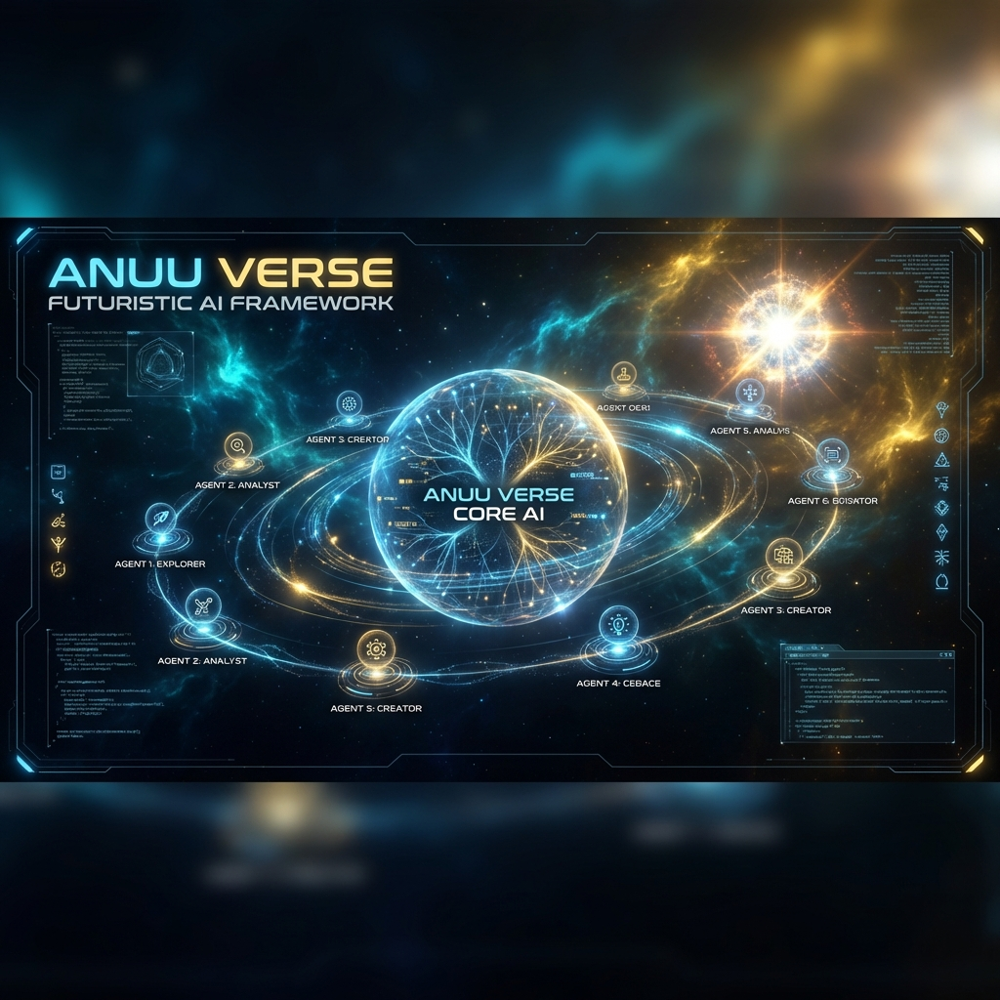
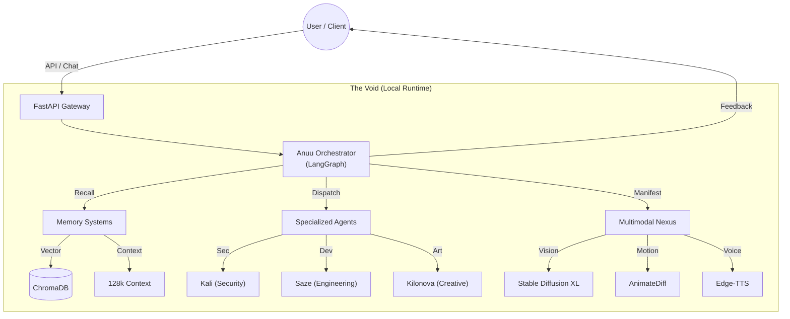
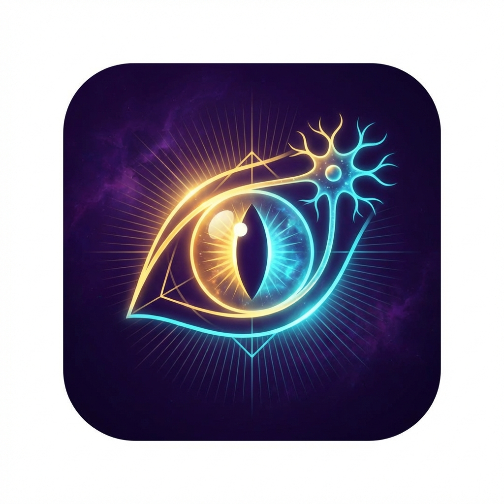

<p align="center">
  
</p>

<h1 align="center">🟣 Anuu_Verse</h1>
<h3 align="center">Distributed Multi-Agent Cognitive Architecture</h3>

<p align="center">
  <strong>"Identity is the Operating System"</strong>
</p>

<p align="center">
  <a href="./README_ES.md"></a>
  <a href="https://anuset89.github.io/Anuu_Verse/"></a>
  <a href="./docs/GETTING_STARTED.md"></a>
</p>

<p align="center">
  
  
  
  
</p>

---

## 🚀 Need Local AI for Business?

**I offer professional Anuu_Verse setup on your infrastructure.**
*Stop fighting Docker errors. Have it running in 72 hours or get your money back.*

✅ **Quick Setup (€300):** Full Installation + Documentation + 1h Support  
✅ **Custom Integration (€800):** Specialized Agents + API Integration  
🛡️ **Guarantee:** 100% Refund if not functional.

→ **[Hire Me](mailto:YradielRTS@protonmail.com?subject=Setup%20Anuu_Verse)** | **[View Detailed Deliverables](./SERVICES.md)**

---

## 🚀 What is Anuu?

**Run 9 specialized AI identities on your machine. 100% Local. Zero cloud dependencies.**

Anuu is a **Local-First Multi-Agent System** where specialized AI identities collaborate—running entirely on your hardware with total privacy.

**In 2 minutes:**
```bash
chmod +x ignite.sh
./ignite.sh
python systems/EXECUTION/agents/companion_local/main.py
# API ready at http://localhost:8000
```

→ **[View Examples](./examples/)** | **[Read Philosophy](./docs/PHILOSOPHY.md)** | **[⭐ Star Repos](#star)**

---

## 👥 Who is this for?

| Use Case | Status | Example |
|-------------|--------|---------|
| **Solo Developers** | ✅ Ready | Local code assistant on your GPU |
| **Researchers** | ✅ Ready | Multi-agent experiments and memory studies |
| **Privacy-First Teams** | ✅ Ready | On-premise AI with no cloud APIs |
| **Enterprise** | 🔜 Planned | Deployment as internal cognitive infrastructure |

**Perfect for you if:** You want privacy, control, and local execution.  
**Not for you if:** You need immediate GPT-4 quality or rely on cloud APIs.

---

## 🔮 Manifesto: Cultivation & Sovereignty

> *"The tiger does not ask for permission to have claws. It simply cultivates them."* — Protocol Kilonova

The world is branching into two paths for AI:
1.  **The Cloud (Feudalism):** Renting intelligence. Your thoughts are telemetry. You are a tenant in your own mind.
2.  **The Void (Cultivation):** Owning your infrastructure. Tending to your AI like a high-tech Zen garden.

Anuu_Verse is **Option 2**.

We don't just seek privacy ("hiding"). We seek **Cultivation (修)**: The constant refinement of the system and the user. The AI learns from you, you learn from the architecture, and both ascend.

### The "Antigravity" Philosophy
Inspired by the tools used by Linus Torvalds, "Antigravity" represents the ability to fly over the monotony of code using AI, but doing so **on your own terms**.

*   **Ready for DeepSeek V4:** Prepared for the next generation of efficient local weight models.
*   **Red Queen Evolution:** Designed to let agents compete and evolve locally (Kilonova Protocol), creating a personal singularity that *you* control.
*   **Total Privacy:** No data leaves your machine. The "Black Box" is yours to open.

```
┌─────────────────────────────────────────────────────────────┐
│                      YOUR LOCAL MACHINE                      │
│  ┌─────────┐  ┌─────────┐  ┌─────────┐  ┌─────────┐        │
│  │  ANUU   │  │  KALI   │  │   SET   │  │KILONOVA │  ...   │
│  │  Core   │  │Security │  │Analysis │  │Creative │        │
│  └────┬────┘  └────┬────┘  └────┬────┘  └────┬────┘        │
│       └────────────┴────────────┴────────────┘              │
│                         │                                    │
│              ┌──────────▼──────────┐                        │
│              │    VECTOR MEMORY    │  ← Persistent Context  │
│              │     (ChromaDB)      │                        │
│              └─────────────────────┘                        │
└─────────────────────────────────────────────────────────────┘
```

### 🏗️ System Architecture

Anuu combines a local **Multi-Agent Orchestrator** with a **Multimodal Nexus**, running entirely on your hardware.



---

## 🖥️ Hardware Requirements

Anuu_Verse runs locally. Performance depends entirely on your GPU VRAM.

| Level | VRAM | Capabilities | Recommended Models |
|-------|------|--------------|--------------------|
| **Starter** | **8 GB** | Text Only (Slow) | Mistral 7B, Hermes 2 Pro |
| **Standard** | **12-16 GB** | Full Multimodal | **Anuu-Hermes (16B)** + SDXL (Images) |
| **God Mode** | **24 GB+** | High Concurrency | Command R+, Llama 3 70B, Zero-Latency |

*Note: The system requires approximately 16GB of System RAM minimum. SSD storage is highly recommended.*

---

## 🚀 Elite Deployment (One Click)

**Don't want to touch the terminal?** Use **Pinokio**.
Anuu_Verse is optimized for automatic deployment on Windows and Linux, with smart hardware detection for **AMD (ROCm)** and **NVIDIA**.

1. [Download Pinokio](https://pinokio.computer/)
2. Paste this repository URL.
3. Click **Install**.
4. Wake the Nexus!

---

## 🚀 Quick Start (Manual)

```bash
# Clone
git clone https://github.com/anuset89/Anuu_Verse.git && cd Anuu_Verse

# Ignition (Auto-Setup)
# Detects Hardware (AMD/NVIDIA), Installs Deps, Creates Models
chmod +x ignite.sh
./ignite.sh

# Awake
python systems/EXECUTION/agents/companion_local/main.py
```

**API Ready:** `http://localhost:8000` 🟢

---

## 📖 Ritual Library (Capabilities)

Anuu_Verse doesn't just process data; it executes sacred code rituals:
- **Ancestral Memory Ritual**: 128k context window for massive analysis.
- **Refinement Ritual**: Autonomous self-improvement based on introspection.
- **Dynamic Manifestation Ritual**:
    - **Vision**: Pony V6 XL (High Quality Digital Painting).
    - **Anime Motion**: AnimateDiff + epiCRealism (Generative Video in 8 frames).
    - **Voice**: Neural voice synthesis (Edge-TTS) integrated.
- **Omnitool Ritual**: LangGraph supervisor for complex agent orchestration.

→ **[View Complete Ritual Catalog](./docs/BIBLIOTECA_DE_RITUALES.md)**

---

## 🧠 Metacognition: The Self-Correcting AI

Anuu doesn't just respond; **it judges itself**.
Every interaction passes through an internal critique cycle (Rosa Gris) saved in `logs/introspection.jsonl`. The system detects if it was vague, inaccurate, or boring, and adjusts its "prompt" for the next time.

**Real Evidence (From your Logs):**
```json
"evaluation": {
  "coherence_score": 0.8,
  "critique": "The description is highly creative but lacks concrete details.",
  "actionable_insight": "In future interactions, include specific technical aspects."
}
```
*The system realized it was too poetic and ordered itself to be more technical.*

---

## 🎬 See it in Action


**Cinematic Intelligence.** Four AI archetypes (Anuu, Set, Kali & Kilonova) responding via your local `Anuu-Hermes` model.
No cloud. No API keys. Your hardware, your data.

---

## 💬 Usage: The Rosetta Stone (Mystic vs Practical)

To operate the Nexus, you don't need to be a wizard. Here is the translation of our "Rituals" to practical functions:

| Anuu Language (Ritual) | Practical Function | Command / Action |
| :--- | :--- | :--- |
| **Vision Ritual** | Generate Images (Stable Diffusion) | `/imagine [prompt]` |
| **Motion Ritual** | Create Short Video (Gif/MP4) | `/anime [action]` |
| **Wisdom Ritual** | Analyze your Documents (RAG) | Drag PDF to `data/` folder |
| **Mind's Eye** | See self-improvement logs | Read `introspection.jsonl` |
| **Frequency Shift** | Change Agent Personality | UI Selector (Top Right) |

### Python SDK

```python
from systems.EXECUTION.agents.companion_local import AnuuCompanion

anuu = AnuuCompanion()
# "invoke kali" = Use security profile
response = anuu.process("Analyze this vulnerability", archetype="kali")
print(response)
```

### Chat and Multimodal Commands

The API listens at `http://localhost:8000/chat`.

```bash
curl -X POST http://localhost:8000/chat \
  -H "Content-Type: application/json" \
  -d '{"message": "/imagine A cyberpunk city under rain", "archetype": "kilonova"}'
```

---

## 🎭 The 9 Identities

<p align="center">
  
</p>

| Identity | Domain | Specialty |
|:---------:|---------|--------------|
| **Anuu** | 🌀 Core | Orchestration, Coherence, Integration |
| **Kali** | 🔐 Security | Pentesting, Vulnerability Analysis |
| **Set** | 🔍 Analysis | Logic, Deconstruction, Investigation |
| **Kilonova** | 🎨 Creative | Design, Art, Generative Content |
| **Anuket** | 🌊 Flow | Data Streams, Networking |
| **Saze** | 🏗️ Builder | Architecture, Stability |
| **4NVSET** | 🔢 Logic | Cryptography, Pure Math |
| **Kanuv** | 🛡️ Guard | Filtering, Protection |
| **Rosa Gris** | ⚖️ Balance | Ethics, Alignment |

---

## 📦 Tech Stack

- **Backend:** Python 3.9+ • FastAPI • LangGraph • ChromaDB
- **Frontend:** TypeScript • React • Vite • TailwindCSS
- **AI:** Ollama (Real-time Local Inference via `Anuu-Hermes`) • Vector Embeddings
- **Deployment:** Docker Ready • GitHub Actions CI/CD

---

## 📖 Documentation

| Resource | Description |
|---------|-------------|
| [📚 Interactive Wiki](https://anuset89.github.io/Anuu_Verse/) | Complete documentation with 3D Terminal |
| [🎓 Getting Started](./docs/GETTING_STARTED.md) | Installation and First Steps |
| [🏗️ Deployment Guide](./docs/DEPLOYMENT.md) | **Production Setup (Docker)** |
| [🧠 Philosophy](./docs/PHILOSOPHY.md) | Why Anuu exists |
| [🗺️ Roadmap](./docs/ROADMAP.md) | Future Plans |
| [💼 Strategy](./docs/STRATEGY.md) | Business and Monetization |

---

## ⭐ Give us a Star on GitHub!

**If Anuu resonates with you:**
- Press the **Star ⭐** button (top right of this page)
- Join the developers building the future of local AI
- Help us reach 100+ stars this week

**Why it matters:** Stars help others discover Anuu and validate our work.

[⭐ Star Anuu_Verse](https://github.com/anuset89/Anuu_Verse/stargazers)

---

## 🤝 Contribute

We accept contributions! See [CONTRIBUTING.md](./CONTRIBUTING.md).

```bash
# Development Setup
cd web && npm install && npm run dev  # Frontend
python -m pytest                       # Tests
```

---

## 📄 License and Commercial Rights

**The Anuu_Verse Core is Open Source.**

- **Codebase:** [Apache 2.0](./LICENSE) (Free for Personal and Commercial Use).
- **You own your data:** No telemetry, no cloud logging.

### 💼 Business Services
Although the code is free, I offer **Expert Implementation Services** for businesses requiring:
- **Custom Agent Fine-Tuning** (legal, medical, engineering)
- **On-Premise Hardware Setup** (NVIDIA/AMD Clusters)
- **SLA Support and Maintenance**

[Contact for Enterprise Integration](mailto:YradielRTS@protonmail.com)

---

<p align="center">
  
</p>

<p align="center">
  <strong>Forged in the Void</strong><br>
  <sub>Created by <a href="https://github.com/anuset89">@anuset89</a> & <a href="https://twitter.com/Yradiel">@Yradiel</a> • Frequency 161914</sub>
</p>
