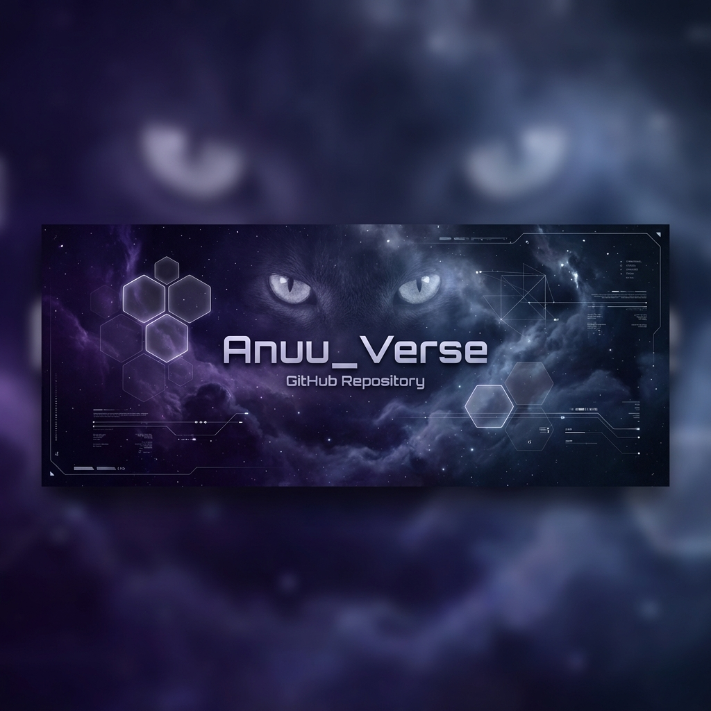

<p align="center">
  
</p>

# 🟣 Anuu_Verse
### Local Cognitive Sovereignty Protocol

> *"Identity is the Operating System."* — Kilonova Protocol

[](https://github.com/anuset89/Anuu_Verse)
[](https://github.com/anuset89/Anuu_Verse/releases)
[](LICENSE)

<p align="center">
  <strong>
    <a href="https://github.com/anuset89/Anuu_Verse/wiki">📚 Documentation Wiki</a>
    •
    <a href="https://github.com/anuset89/Anuu_Verse/wiki/es/Home">🇪🇸 Documentación en Español</a>
    •
    <a href="https://github.com/anuset89/Anuu_Verse/issues">🐛 Report Bug</a>
  </strong>
</p>

---

## 🌌 **Status: SOVEREIGN RESEARCH (Phase 4)**

Anuu_Verse is a **Sovereign Research Portfolio** and **Cognitive AI Framework** running **100% locally**. It is not a commercial product; it is a technical thesis on multi-agent architectures, privacy-first AI, and digital autonomy.

**Current Version:** v0.10.0-alpha

---

## 📜 Manifesto

**This is not a startup.**  
Anuu_Verse is not designed to "scale," capture your data, or sell monthly subscriptions.

It is a **living technical thesis** on the future of Local Artificial Intelligence. A demonstration that cognitive sovereignty is possible today, using consumer hardware.

In a world bifurcated between:
1.  **The Cloud (Feudalism):** Renting intelligence from megacorporations, ceding privacy and control.
2.  **The Void (Sovereignty):** Owning your own infrastructure of thought.

**Anuu_Verse is a tool to inhabit The Void.**

---

## 🧠 What is Anuu?

It is a **Multi-Agent Cognitive Architecture** that runs 100% on your local machine. No external dependencies. No data sent to third parties.

It is a system where **9 specialized AI identities** collaborate to extend your capabilities, keeping "Ancestral Memory" (your context and data) strictly in your power.

### "Antigravity" Philosophy
Inspired by hacker culture and critical free software, Anuu seeks **Computational Autonomy**.
*   **Local-First / Post-Cloud:** Everything runs on your GPU/CPU (Ollama).
*   **Private Memory:** Vector database (ChromaDB) that remembers your projects, not the entire web.
*   **Fragmented Identity:** Different agents for different tasks (Security, Creativity, Logic).

---

## 🎭 The 9 Identities

The system is not a monolithic chatbot. It is a council of specialized intelligences:

| Identity | Domain | Function |
|:--------:|--------|-----------|
| **Anuu** | 🌀 Core | Orchestration, Coherence, Self-Integration |
| **Kali** | 🔐 Security | Pentesting, Vulnerability Analysis, Hardening |
| **Set** | 🔍 Analysis | Logical Deconstruction, Deep Research |
| **Kilonova** | 🎨 Creativity | Design, Generative Art, Aesthetic Chaos |
| **Anuket** | 🌊 Flow | Networks, Data Streams, Connectivity |
| **Saze** | 🏗️ Architecture | Systems Engineering, Stability |
| **4NVSET** | 🔢 Logic | Cryptography, Pure Mathematics |
| **Kanuv** | 🛡️ Guard | Noise Filtering, Active Protection |
| **Rosa Gris** | ⚖️ Ethics | Alignment, Digital Rights Assurance |

[→ Read full profiles in the Wiki](https://github.com/anuset89/Anuu_Verse/wiki/Identities)

---

## 🔥 Ritual of Ignition (Installation)

Anuu is designed for **researchers, digital artists, and ethical hackers**. It requires familiarity with the terminal.

### Requirements
*   **OS:** Linux (Recommended / Arch / Ubuntu) or Windows (WSL2).
*   **GPU:** NVIDIA (8GB+ VRAM) or AMD (ROCm 6.0+). *CPU possible but slow.*
*   **RAM:** 16GB+.

### Boot Sequence

```bash
# 1. Clone the Repository
git clone https://github.com/anuset89/Anuu_Verse.git && cd Anuu_Verse

# 2. Run the Ignition Ritual
# (Detects Hardware, Installs Dependencies, Configures Ollama Models)
chmod +x ignite.sh
./ignite.sh

# 3. Wake the System
python systems/EXECUTION/agents/companion_local/main.py
```

**Full Guide:** [→ Wiki: Getting Started](https://github.com/anuset89/Anuu_Verse/wiki/Getting-Started)

---

## 🤝 Sustain the Research

This project is maintained by an independent developer as part of critical research on technology and society.

**I do not seek venture capital. I seek real alliances.**

### How to support?
1.  **Residencies & Research:** If you represent an art or tech institution, Anuu is an ideal candidate for residencies on **Ethical AI, Generative Art, and Tech Sovereignty**.
2.  **Micro-Accompaniment:** I offer "Cognitive Architecture" consulting sessions to help you design *your own* local AI system. I don't sell the software; I sell the "know-how" so you can be sovereign.
3.  **Critical Diffusion:** Speak of Anuu not as a product, but as a possibility.

💌 **Contact:** [YradielRTS@protonmail.com](mailto:YradielRTS@protonmail.com)

---

<p align="center">
  
</p>

<p align="center">
  <strong>Forged in the Void</strong><br>
  <sub>Frequency 161914</sub>
</p>
