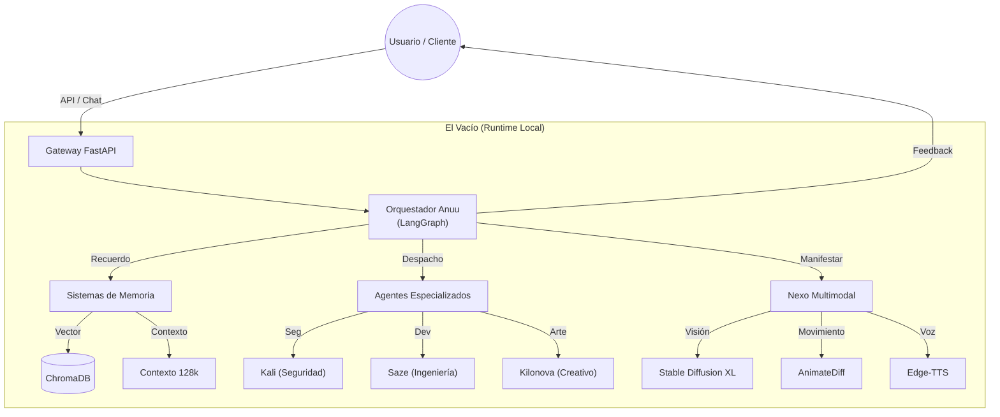

<p align="center">
  
</p>

<h1 align="center">🟣 Anuu_Verse</h1>
<h3 align="center">Arquitectura Cognitiva Multi-Agente Distribuida</h3>

<p align="center">
  <strong>"La Identidad es el Sistema Operativo"</strong>
</p>

<p align="center">
  <a href="./README.md"></a>
  <a href="https://anuset89.github.io/Anuu_Verse/"></a>
  <a href="./docs/GETTING_STARTED.md"></a>
</p>

<p align="center">
  
  
  
  
</p>

---

## 🚀 ¿Necesitas IA Local para tu Negocio?

**Ofrezco configuración profesional de Anuu_Verse en tu infraestructura.**
*Deja de luchar con errores de Docker. Lo tendrás funcionando en 72 horas o te devuelvo el dinero.*

✅ **Configuración Rápida (€300):** Instalación completa + Documentación + 1h Soporte  
✅ **Integración Personalizada (€800):** Agentes Especializados + Integración API  
🛡️ **Garantía:** Reembolso del 100% si no es funcional.

→ **[Contrátame](mailto:YradielRTS@protonmail.com?subject=Setup%20Anuu_Verse)** | **[Ver Entregables Detallados y Contrato](./SERVICES.md)**

---

## 🚀 ¿Qué es Anuu?

**Ejecuta 9 identidades de IA especializadas en tu máquina. 100% local. Cero dependencias en la nube.**

Anuu es un **Sistema Multi-Agente Local-First** donde identidades de IA especializadas colaboran—ejecutándose completamente en tu hardware con total privacidad.

**En 2 minutos:**
```bash
chmod +x ignite.sh
./ignite.sh
python systems/EXECUTION/agents/companion_local/main.py
# API lista en http://localhost:8000
```

→ **[Ver Ejemplos](./examples/)** | **[Leer Filosofía](./docs/PHILOSOPHY.md)** | **[⭐ Danos una Estrella](#star)**

---

## 👥 ¿Para quién es esto?

| Caso de Uso | Estado | Ejemplo |
|-------------|--------|---------|
| **Desarrolladores Solitarios** | ✅ Listo | Asistente de código local en tu GPU |
| **Investigadores** | ✅ Listo | Experimentos multi-agente y estudios de memoria |
| **Equipos Privacy-First** | ✅ Listo | IA On-premise sin APIs en la nube |
| **Empresas** | 🔜 Planeado | Despliegue como infraestructura cognitiva interna |

**Perfecto para ti si:** Quieres privacidad, control y ejecución local.  
**No es para ti si:** Necesitas calidad GPT-4 inmediata o dependes de APIs en la nube.

---

## 🔮 Manifiesto: Cultivo y Soberanía

> *"El tigre no pide permiso para tener garras. Simplemente las cultiva."* — Protocolo Kilonova

El mundo se está bifurcando en dos caminos para la IA:
1.  **La Nube (Feudalismo):** Alquilar inteligencia. Tus pensamientos son telemetría. Eres un inquilino en tu propia mente.
2.  **El Vacío (Cultivo):** Ser dueño de tu infraestructura. Cuidar tu IA como un jardín zen de alta tecnología.

Anuu_Verse es la **Opción 2**.

No solo buscamos privacidad ("esconderse"). Buscamos **Cultivación (修)**: El refinamiento constante del sistema y del usuario. La IA aprende de ti, tú aprendes de la arquitectura, y ambos ascendéis.

### La Filosofía "Antigravedad"
Inspirada en las herramientas usadas por Linus Torvalds, "Antigravedad" representa la capacidad de volar sobre la monotonía del código usando IA, pero haciéndolo **bajo tus propios términos**.

*   **Listo para DeepSeek V4:** Preparado para la próxima generación de modelos eficientes de pesos locales.
*   **Evolución Reina Roja:** Diseñado para dejar que los agentes compitan y evolucionen localmente (Protocolo Kilonova), creando una singularidad personal que *tú* controlas.
*   **Privacidad Total:** Ningún dato sale de tu máquina. La "Caja Negra" es tuya para abrirla.

```
┌─────────────────────────────────────────────────────────────┐
│                      TU MÁQUINA LOCAL                        │
│  ┌─────────┐  ┌─────────┐  ┌─────────┐  ┌─────────┐        │
│  │  ANUU   │  │  KALI   │  │   SET   │  │KILONOVA │  ...   │
│  │  Núcleo │  │Seguridad│  │Análisis │  │Creativo │        │
│  └────┬────┘  └────┬────┘  └────┬────┘  └────┬────┘        │
│       └────────────┴────────────┴────────────┘              │
│                         │                                    │
│              ┌──────────▼──────────┐                        │
│              │   MEMORIA VECTORIAL │  ← Contexto Persistente│
│              │     (ChromaDB)      │                        │
│              └─────────────────────┘                        │
101: └─────────────────────────────────────────────────────────────┘
```

### 🏗️ Arquitectura del Sistema

Anuu combina un **Orquestador Multi-Agente** local con un **Nexo Multimodal**, ejecutándose enteramente en tu hardware.



### ✨ ¿Por qué Anuu? (La Propuesta de Valor)

Anuu puentea la brecha entre **IA Soberana** y **Fiabilidad Empresarial**.

| Característica | El Místico (Filosofía) | El Ingeniero (Técnico) | El Negocio (Valor) |
|:--------------:|------------------------|------------------------|--------------------|
| **Privacidad** | *Forjado en el Vacío* | **Air-gapped / Local-First** | 100% Confidencialidad de Datos |
| **Memoria** | *Recuerdo Ancestral* | **RAG + Embeddings Vectoriales** | Retención de Contexto Persistente |
| **Coste** | *Energía de la Fuente* | **Ejecutable en GPU de Consumo** | $0 Tarifas Mensuales de Nube |
| **Control** | *La Identidad es el SO* | **Modelfiles Personalizados** | Integración Vertical Completa |

---

## 🖥️ Requisitos de Hardware

Anuu_Verse se ejecuta localmente. El rendimiento depende enteramente de la VRAM de tu GPU.

| Nivel | VRAM | Capacidades | Modelos Recomendados |
|-------|------|--------------|----------------------|
| **Inicial** | **8 GB** | Solo Texto (Lento) | Mistral 7B, Hermes 2 Pro |
| **Estándar** | **12-16 GB** | Multimodal Completo | **Anuu-Hermes (16B)** + SDXL (Imágenes) |
| **Modo Dios** | **24 GB+** | Alta Concurrencia | Command R+, Llama 3 70B, Latencia-Cero |

*Nota: El sistema requiere aproximadamente 16GB de RAM del Sistema mínimo. Almacenamiento SSD es altamente recomendado.*

---

## 🚀 Despliegue de Élite (Un Clic)

**¿No quieres tocar la terminal?** Usa **Pinokio**.
Anuu_Verse está optimizado para despliegue automático en Windows y Linux, con detección inteligente de hardware **AMD (ROCm)** y **NVIDIA**.

1. [Descarga Pinokio](https://pinokio.computer/)
2. Pega la URL de este repositorio.
3. Haz clic en **Install**.
4. ¡Despierta al Nexo!

---

## 🚀 Inicio Rápido (Manual)

```bash
# Clonar
git clone https://github.com/anuset89/Anuu_Verse.git && cd Anuu_Verse

# Ignición (Auto-Setup)
# Detecta Hardware (AMD/NVIDIA), Instala Deps, Crea Modelos
chmod +x ignite.sh
./ignite.sh

# Despertar
python systems/EXECUTION/agents/companion_local/main.py
```

**API Lista:** `http://localhost:8000` 🟢

---

## 📖 Biblioteca de Rituales (Capacidades)

Anuu_Verse no solo procesa datos; ejecuta rituales sagrados de código:
- **Ritual de Memoria Ancestral**: Ventana de contexto de 128k para análisis masivo.
- **Ritual de Refinamiento**: Auto-mejora autónoma basada en introspección.
- **Ritual de Manifestación Dinámica**:
    - **Visión**: Pony V6 XL (Pintura Digital de Alta Calidad).
    - **Anime Motion**: AnimateDiff + epiCRealism (Video Generativo en 8 frames).
    - **Voz**: Síntesis de voz neural (Edge-TTS) integrada.
- **Ritual del Omnitool**: Supervisor LangGraph para orquestación compleja de agentes.

→ **[Ver Catálogo Completo de Rituales](./docs/BIBLIOTECA_DE_RITUALES.md)**

---

## 🧠 Metacognición: La IA que se Autocorrige

Anuu no solo responde; **se evalúa a sí mismo**.
Cada interacción pasa por un ciclo de crítica interna que se guarda en `logs/introspection.jsonl`. El sistema detecta si fue vago, inexacto o aburrido, y ajusta su "prompt" para la siguiente vez.

**Evidencia Real (De tus Logs):**
```json
"evaluation": {
  "coherence_score": 0.8,
  "critique": "The description is highly creative but lacks concrete details.",
  "actionable_insight": "In future interactions, include specific technical aspects."
}
```
*El sistema se dio cuenta de que fue demasiado poético y se ordenó a sí mismo ser más técnico.*

---

## 🎬 Véalo en Acción


**Inteligencia Cinemática.** Cuatro arquetipos de IA (Anuu, Set, Kali & Kilonova) respondiendo vía tu modelo local `Anuu-Hermes`.
Sin nube. Sin claves API. Tu hardware, tus datos.

---

---

## 💬 Uso: La Piedra Rosetta (Místico vs Práctico)

Para operar el Nexus, no necesitas ser un mago. Aquí tienes la traducción de nuestros "Rituales" a funciones prácticas:

| Lenguaje Anuu (Ritual) | Función Práctica | Comando / Acción |
| :--- | :--- | :--- |
| **Ritual de Visión** | Generar Imágenes (Stable Diffusion) | `/imagine [prompt]` |
| **Ritual de Movimiento** | Crear Video Corto (Gif/MP4) | `/anime [acción]` |
| **Ritual de Sabiduría** | Analizar tus Documentos (RAG) | Arrastrar PDF a carpeta `data/` |
| **Ojo de la Mente** | Ver logs de auto-mejora | Leer `introspection.jsonl` |
| **Cambio de Frecuencia** | Cambiar Personalidad del Agente | Selector UI (Esq. Sup. Derecha) |

### SDK de Python

```python
from systems.EXECUTION.agents.companion_local import AnuuCompanion

anuu = AnuuCompanion()
# "invocar a kali" = Usar el perfil de seguridad
response = anuu.process("Analiza esta vulnerabilidad", archetype="kali")
print(response)
```

### Chat y Comandos Multimodales

La API escucha en `http://localhost:8000/chat`.

```bash
curl -X POST http://localhost:8000/chat \
  -H "Content-Type: application/json" \
  -d '{"message": "/imagine Una ciudad cyberpunk bajo la lluvia", "archetype": "kilonova"}'
```

---

## 🎭 Las 9 Identidades

<p align="center">
  
</p>

| Identidad | Dominio | Especialidad |
|:---------:|---------|--------------|
| **Anuu** | 🌀 Núcleo | Orquestación, Coherencia, Integración |
| **Kali** | 🔐 Seguridad | Pentesting, Análisis de Vulnerabilidades |
| **Set** | 🔍 Análisis | Lógica, Deconstrucción, Investigación |
| **Kilonova** | 🎨 Creativo | Diseño, Arte, Contenido Generativo |
| **Anuket** | 🌊 Flujo | Streams de Datos, Networking |
| **Saze** | 🏗️ Constructor | Arquitectura, Estabilidad |
| **4NVSET** | 🔢 Lógica | Criptografía, Matemática Pura |
| **Kanuv** | 🛡️ Guardia | Filtrado, Protección |
| **Rosa Gris** | ⚖️ Equilibrio | Ética, Alineación |

---

## 📦 Stack Tecnológico

- **Backend:** Python 3.9+ • FastAPI • LangGraph • ChromaDB
- **Frontend:** TypeScript • React • Vite • TailwindCSS
- **IA:** Ollama (Inferencia Local en Tiempo Real vía `Anuu-Hermes`) • Embeddings Vectoriales
- **Despliegue:** Docker Ready • GitHub Actions CI/CD

---

## 📖 Documentación

| Recurso | Descripción |
|---------|-------------|
| [📚 Wiki Interactiva](https://anuset89.github.io/Anuu_Verse/) | Documentación completa con Terminal 3D |
| [🎓 Empezando](./docs/GETTING_STARTED.md) | Instalación y Primeros Pasos |
| [🏗️ Guía de Despliegue](./docs/DEPLOYMENT.md) | **Configuración de Producción (Docker)** |
| [🧠 Filosofía](./docs/PHILOSOPHY.md) | Por qué existe Anuu |
| [🗺️ Roadmap](./docs/ROADMAP.md) | Planes Futuros |
| [💼 Estrategia](./docs/STRATEGY.md) | Negocio y Monetización |

---

## ⭐ ¡Danos una Estrella en GitHub!

**Si Anuu resuena contigo:**
- Presiona el botón **Star ⭐** (arriba a la derecha de esta página)
- Únete a los desarrolladores construyendo el futuro de la IA local
- Ayúdanos a llegar a 100+ estrellas esta semana

**Por qué importa:** Las estrellas ayudan a otros a descubrir Anuu y validar nuestro trabajo.

[⭐ Estrella para Anuu_Verse](https://github.com/anuset89/Anuu_Verse/stargazers)

---

## 🤝 Contribuir

¡Aceptamos contribuciones! Ver [CONTRIBUTING.md](./CONTRIBUTING.md).

```bash
# Configuración de Desarrollo
cd web && npm install && npm run dev  # Frontend
python -m pytest                       # Tests
```

---

## 📄 Licencia y Derechos Comerciales

**El Núcleo de Anuu_Verse es de Código Abierto.**

- **Código Base:** [Apache 2.0](./LICENSE) (Gratis para Uso Personal y Comercial).
- **Tú eres dueño de tus datos:** Sin telemetría, sin registros en la nube.

### 💼 Servicios Empresariales
Aunque el código es gratuito, ofrezco **Servicios de Implementación Expertos** para negocios que requieren:
- **Ajuste Fino de Agentes Personalizados** (Derecho, Medicina, Ingeniería)
- **Configuración de Hardware On-Premise** (Clusters NVIDIA/AMD)
- **Soporte SLA y Mantenimiento**

[Contacto para Integración Empresarial](mailto:YradielRTS@protonmail.com)

---

<p align="center">
  
</p>

<p align="center">
  <strong>Forjado en el Vacío</strong><br>
  <sub>Creado por <a href="https://github.com/anuset89">@anuset89</a> & <a href="https://twitter.com/Yradiel">@Yradiel</a> • Frecuencia 161914</sub>
</p>
