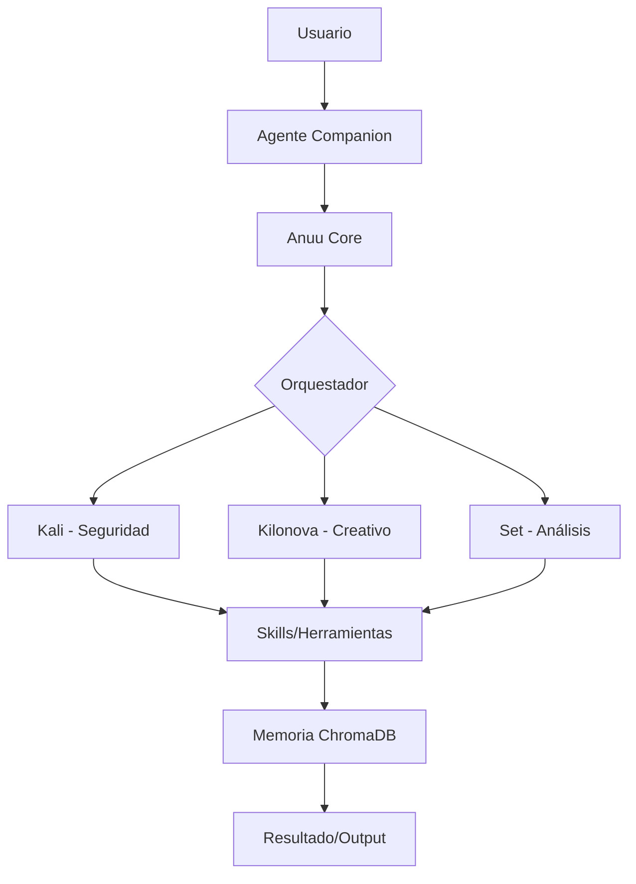

# Anuu_Verse: Arquitectura del Sistema

**Versión:** v0.10.0-alpha  
**Tipo de Arquitectura:** Sistema Cognitivo Distribuido  
**Paradigma:** IA Multi-Identidad con Bucles de Auto-Corrección

> 🌐 **Idioma:** [English](../Architecture) • [Español](#)

---

## Visión General de Alto Nivel

## ⚖️ Requisitos de Recursos por Agente

| Agente | VRAM Req | RAM Req | Casos de Uso | Modelo Recomendado |
|--------|----------|---------|--------------|--------------------|
| **Anuu Core** | 2GB | 4GB | Coordinación general, charla | Llama-3-8B |
| **Kali** | 4GB | 8GB | Pentesting, análisis de logs | DeepSeek-Coder-V2 |
| **Kilonova** | 8GB+ | 12GB | Generación visual / creativa | Llama-3-70B (Quant) |
| **Set** | 3GB | 6GB | Investigación, deducción | Mistral-Nemo |
