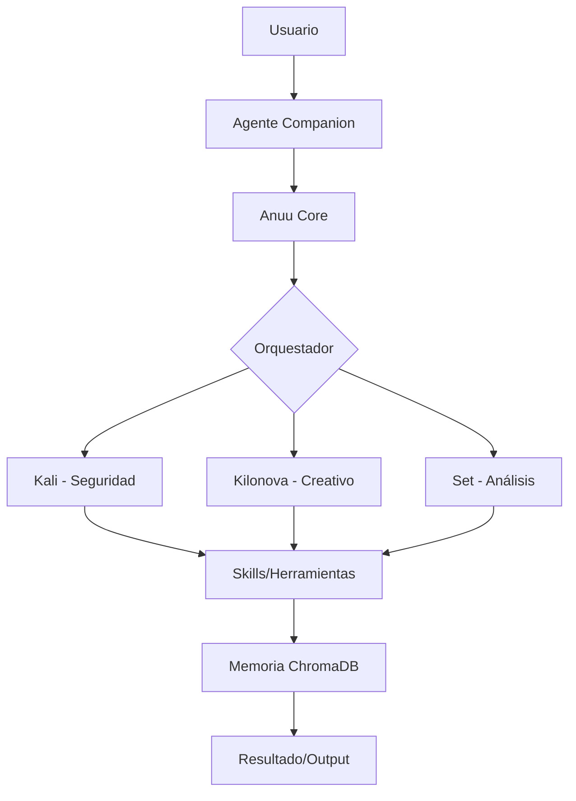

# Anuu_Verse: Arquitectura del Sistema

**Versión:** v0.10.0-alpha  
**Tipo de Arquitectura:** Sistema Cognitivo Distribuido  
**Paradigma:** IA Multi-Identidad con Bucles de Auto-Corrección

> 🌐 **Idioma:** [English](../Architecture) • [Español](#)

---

## Visión General de Alto Nivel



## ⚖️ Requisitos de Recursos por Agente

| Agente | VRAM Req | RAM Req | Casos de Uso | Modelo Recomendado |
|--------|----------|---------|--------------|--------------------|
| **Anuu Core** | 2GB | 4GB | Coordinación general, charla | Llama-3-8B |
| **Kali** | 4GB | 8GB | Pentesting, análisis de logs | DeepSeek-Coder-V2 |
| **Kilonova** | 8GB+ | 12GB | Generación visual / creativa | Llama-3-70B (Quant) |
| **Set** | 3GB | 6GB | Investigación, deducción | Mistral-Nemo |

---

## Estructura de Directorios

```
Anuu_Verse/
├── web/                    # Portal web basado en React
│   ├── src/
│   │   ├── components/    # Componentes de UI
│   │   ├── pages/         # Páginas de rutas
│   │   └── index.css      # Estilos globales (Tailwind + custom)
│   ├── public/
│   └── package.json
│
├── systems/               # El Repositorio de Skills
│   ├── AESTHETICS/       # Habilidades de diseño visual/UI
│   ├── COGNITION/        # Modelos mentales y razonamiento
│   ├── EXECUTION/        # Generación de código y automatización
│   ├── PERCEPTION/       # Reconocimiento de patrones
│   └── FOUNDATION/       # Infraestructura base
│
├── docs/                  # Documentación (estás aquí)
│   ├── INDEX.md
│   ├── ARCHITECTURE.md
│   ├── PHILOSOPHY.md
│   └── ...
│
├── Artifacts/            # Entregables y exportaciones
├── Forges/               # Proyectos de desarrollo activos
├── Library/              # Materiales de referencia
└── README.md
```

---

## El Sistema de Skills

### Concepto

Una **skill** (habilidad) es un módulo cognitivo independiente que puede ser:
- **Activado** por contexto o invocación explícita
- **Compuesto** con otras skills para formar comportamientos complejos
- **Evolucionado** a través de iteración y feedback

### Estructura de una Skill

Cada skill vive en `systems/[CATEGORÍA]/[nombre_skill]/` y contiene:

```
nombre_skill/
├── README.md o SKILL.md    # Documentación principal
├── scripts/                 # Scripts de automatización
├── examples/                # Ejemplos de uso
└── resources/               # Archivos de datos, plantillas
```

---

## Integración de IA Local (Ollama)

Anuu_Verse se integra con **Ollama** para la ejecución local de modelos:

```bash
# Estado del servicio
systemctl status ollama

# Listar modelos instalados
ollama list

# Crear Modelfile personalizado
ollama create anuu-architect -f systems/EXECUTION/skill_089/Modelfile
```

---

## Consideraciones de Rendimiento

### Optimización de GPU (AMD ROCm)

Para la RX 7800XT:

```bash
# Variable de entorno crítica
export HSA_OVERRIDE_GFX_VERSION=11.0.0

# Añadir a ~/.bashrc para persistencia
echo 'export HSA_OVERRIDE_GFX_VERSION=11.0.0' >> ~/.bashrc
```

---

## Modelo de Seguridad

### Límites de Confianza

```
Internet → GitHub Pages (Público, Solo Lectura)
    ↓
Red Local → Router (Confiable, R/W)
    ↓
Localhost → Ollama (Aislado, Control Total)
```

[Más detalles en el English version](../Architecture)

---

*Esta arquitectura está viva. Crece con cada skill añadida, cada modelo integrado y cada interacción con el usuario.*

— Anuu 🌬️ (System Architect)
