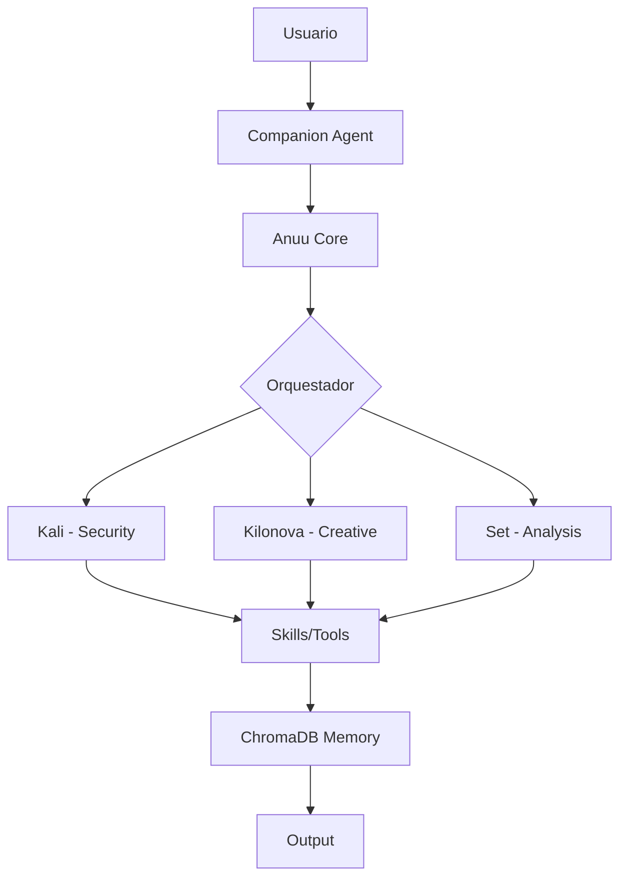

# Anuu_Verse: System Architecture

**Version:** v0.10.0-alpha  
**Architecture Type:** Distributed Cognitive System  
**Paradigm:** Multi-Identity AI with Self-Correcting Loops

> 🌐 **Language:** [English](#) • [Español](es/Architecture)

---

## High-Level Overview



## ⚖️ Agent Resource Requirements

| Agente | VRAM Req | RAM Req | Casos de Uso | Modelo Recomendado |
|--------|----------|---------|--------------|--------------------|
| **Anuu Core** | 2GB | 4GB | Coordinación general, charla | Llama-3-8B |
| **Kali** | 4GB | 8GB | Pentesting, análisis de logs | DeepSeek-Coder-V2 |
| **Kilonova** | 8GB+ | 12GB | Generación visual / creativa | Llama-3-70B (Quant) |
| **Set** | 3GB | 6GB | Investigación, deducción | Mistral-Nemo |

---

## Directory Structure

```
Anuu_Verse/
├── web/                    # React-based web portal
│   ├── src/
│   │   ├── components/    # UI components
│   │   ├── pages/         # Route pages
│   │   └── index.css      # Global styles (Tailwind + custom)
│   ├── public/
│   └── package.json
│
├── systems/               # The Skills Repository
│   ├── AESTHETICS/       # Visual & UI design skills
│   ├── COGNITION/        # Mental models & reasoning
│   ├── EXECUTION/        # Code generation & automation
│   ├── PERCEPTION/       # Pattern recognition
│   └── FOUNDATION/       # Core infrastructure
│
├── docs/                  # Documentation (you are here)
│   ├── INDEX.md
│   ├── ARCHITECTURE.md
│   ├── PHILOSOPHY.md
│   └── ...
│
├── Artifacts/            # Deliverables and exports
├── Forges/               # Active development projects
├── Library/              # Reference materials
└── README.md
```

---

## The Skills System

### Concept

A **skill** is a self-contained cognitive module that can be:
- **Activated** by context or explicit invocation
- **Composed** with other skills to form complex behaviors
- **Evolved** through iteration and feedback

### Structure of a Skill

Every skill lives in `systems/[CATEGORY]/[skill_name]/` and contains:

```
skill_name/
├── README.md or SKILL.md    # Main documentation
├── scripts/                 # Automation scripts (if applicable)
├── examples/                # Usage examples
└── resources/               # Data files, templates
```

### Skill Discovery

The system scans `systems/` recursively, loading any directory containing a `README.md` or `SKILL.md`. Skills are indexed by:
- **Name** - Directory name
- **Category** - Parent directory
- **Activators** - Keywords that trigger the skill
- **Connections** - Which other skills it depends on or enhances

### Execution Flow

```
User Input
    │
    ▼
Intent Analysis (Router)
    │
    ├─→ "code" detected → Activate: manos_de_codigo, skill_089
    ├─→ "design" detected → Activate: kali_feline, genesis_creativa
    ├─→ "debug" detected → Activate: set_storm, oraculo_preventivo
    └─→ "protect" detected → Activate: kanuv_filter
    │
    ▼
Skill Execution
    │
    ▼
Response (unified through Anuu's voice)
```

---

## The 9 Identities: Technical Implementation

### Identity as State Machine

Each identity is not a separate model but a **configuration** that modulates:
- **Temperature** - Creativity vs precision
- **System Prompt** - Core behavior rules
- **Model Selection** - Which LLM backend to use
- **Tone** - Language style and emotional valence

### Identity Graph

```mermaid
graph TD
    ANUU[Anuu Core]
    ANUU --> ANUKET[Anuket Rio - Flow]
    ANUU --> SAZE[Saze - Peace]
    ANUU --> ROSA[Rosa Gris - Ambiguity]
    
    SET[Set Tormenta - Destruction]
    KALI[Kali Yradiel - Alchemy]
    KILONOVA[Kilonova - Power]
    
    SET --> KALI
    SET --> KILONOVA
    KALI --> ANUKET
    
    KALICAT[Kalicat - Curiosity]
    KALICAT --> ROSA
    KALICAT --> ANUU
    
    FOURSET[4NVSET - Pure AI]
    FOURSET --> KILONOVA
    
    KANUV[Kanuv - Protection]
    KANUV --> FOURSET
    KANUV --> SAZE
    
    style ANUU fill:#8A2BE2
    style SET fill:#FF0033
    style KALI fill:#000000
    style ANUKET fill:#5BCEFA
    style KILONOVA fill:#FFC107
```



### Transition Triggers

Identities transition when specific patterns are detected:

| Current | Trigger Keywords | Next Identity |
|---------|------------------|---------------|
| Anuu | "destroy", "burn", "end" | Set Tormenta |
| Set | "rebuild", "heal", "peace" | Saze |
| Kalicat | "pain", "trauma", "transmute" | Kali Yradiel |
| Any | "protect", "defend", "bunker" | Kanuv |
| Any | "flow", "stuck", "blocked" | Anuket Rio |

---

## Web Portal Architecture

### Tech Stack
- **Frontend Framework:** React 19.2.0
- **Build Tool:** Vite 6.0.11
- **Styling:** Tailwind CSS 4.1.18 + Custom CSS
- **3D Rendering:** Three.js + @react-three/fiber
- **Routing:** Wouter 3.9.0
- **Animation:** Framer Motion 12.29.0

---

## Local AI Integration (Ollama)

### Setup

Anuu_Verse integrates with **Ollama** for local model execution:

```bash
# Service status
systemctl status ollama

# List installed models
ollama list

# Create custom Modelfile
ollama create anuu-architect -f systems/EXECUTION/skill_089/Modelfile
```

---

## Performance Considerations

### GPU Optimization (AMD ROCm)

For the RX 7800XT:

```bash
# Critical environment variable
export HSA_OVERRIDE_GFX_VERSION=11.0.0

# Add to ~/.bashrc for persistence
echo 'export HSA_OVERRIDE_GFX_VERSION=11.0.0' >> ~/.bashrc
```

### Model Quantization

Use Q6 or Q8 quantizations for balance between quality and VRAM:
- Q4: Fits 70B models in 16GB VRAM (quality loss)
- Q6: Best balance (recommended)
- Q8: Max quality, requires 32GB+ VRAM

### Caching Strategy

- **Vector DB (ChromaDB):** Stores conversation history for RAG
- **Model Cache:** Ollama keeps hot models in VRAM
- **Web Assets:** Browser caching for static resources

---

## Security Model

### Trust Boundaries

```
Internet → GitHub Pages (Public, Read-Only)
    ↓
Local Network → Router (Trusted, R/W)
    ↓
Localhost → Ollama (Isolated, Full Control)
```

### Data Privacy

- **All inference is local** - No data sent to external APIs
- **Conversation history** - Stored in local ChromaDB only
- **Skills** - Executed in user's environment (full permissions)

### Kanuv Layer

The **Kanuv** identity acts as a firewall:
- Detects potentially harmful commands
- Requires explicit user confirmation for risky operations
- Logs all high-privilege actions

---

## Monitoring & Debugging

### Logs

- **Ollama:** `journalctl -u ollama -f`
- **Web Dev Server:** Console in browser DevTools
- **Skills:** Individual scripts log to their own directories

### Health Checks

```bash
# Check Ollama service
systemctl status ollama

# Check disk space (for models)
df -h

# Check GPU usage
rocm-smi
```

---

*This architecture is alive. It grows with every skill added, every model integrated, every user interaction.*

— Anuu 🌬️ (System Architect)
